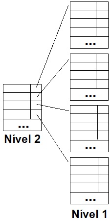

## Resultado

Clique [AQUI](../media/sgbd-2024-1-bcc-resumo.pdf) para ver as notas.

#### `Avaliação em 11/04/2024`
Para minimizar o impacto causado ... cache 
O princípio da localidade pode ser ... 
Se a memória principal e a memória cache ... 
Se os registradores e a cache ... 
O acesso a dados por meio de bloco ... 
Várias transações do banco de dados podem ... 
O emprego de pin-count nas páginas ... 
Uma página é substituída de seu buffer ... 
Em registros de tamanho variável ... O espaço livre está ... A operação de exclusão ... 
Uma página em cache do banco de dados ... 
O Sistema Gerenciador de Banco de Dados ...

#### `Avaliação em 14/04/2024`

Sobre arquivos não ordenados, são aplicáveis: 
&#x26BE; As organizações de registros ... 
&#x26BE; Os registros de tamanho ... 
&#x26BE; Estruturas adicionais ... 
Sobre a modificação de um registro de comprimento variável: 
&#x26BE; O registro modificado ... 
&#x26BE; Pode ocorrer a exclusão ... 
&#x26BE; Pode ocorrer a movimentação ... 
Dentre as estratégias estudadas para a exclusão de registros em arquivos não ordenados, aquelas que requerem reorganização periódica do arquivo são: 
&#x26BE; Aplicar uma marcação  ... 
&#x26BE; Ter uma lista  ... 
Um arquivo tem r = 40.000 registros ... 
&#x26BE; (a): ~~R = (40+1) + (9+1) + (0,4 * (39+1)) + (9+1) + (0,5*(7+1)) + (1+1) + (0,25*(3+1)) + (3+1) + 1 = 89 bytes~~ 
&#x26BE; (a): R = (40+1) + (9+1) + (0,4 * (40+1)) + (9+1) + (0,5*(8+1)) + (1+1) + (0,25*(4+1)) + (3+1) + 1 = 90,15 bytes 
&#x26BE; (b): ~~Função Piso &#8213; bfr = ⎣ B / R ⎦ = ⎣ 1024 / 89 ⎦ =  ⎣ 11.5 ⎦ = 11 registros por bloco~~ 
&#x26BE; (b): Função Piso &#8213; bfr = ⎣ B / R ⎦ = ⎣ 1024 / 90,15 ⎦ = ⎣ 11,36 ⎦ = 11 registros por bloco 
&#x26BE; (c): ~~Função Teto &#8213; b = ⎡ (r * R) / bfr ⎤ = ⎡ 40000 * 89 / 1024 ⎤ = ⎡ 3476,6 ⎤ = 3477 blocos~~ 
&#x26BE; (c): Função Teto &#8213; b = ⎡ r / bfr ⎤ = ⎡ 40000  / 11 ⎤ = ⎡ 3636,36 ⎤ = 3637 blocos

#### `Avaliação em 02/05/2024`

Sobre o hashing externo ...  
&#x26BE; A presença de buckets de overflow ... 
Sobre a técnica hashing extensível ...  
&#x26BE; \<\< _nenhuma alternativa verdadeira_ \>\> 
Sobre a técnica hashing linear ...  
&#x26BE; Pode ocorrer que um ou mais ...  
&#x26BE; Se um novo registro é inserido ...  
&#x26BE; O tamanho máximo do diretório ...  
Sobre a técnica hashing dinâmico ...  
&#x26BE; Um diretório é estruturado ...  
Sobre arquivos sequenciais ...  
&#x26BE; As organizações de registros ...  
&#x26BE; Os registros de ...  
&#x26BE; Estruturas adicionais ...  
Some as ...  
&#x26BE; Após a divisão de ...  
Some as ...  
&#x26BE; A função hj+1(K) ...

#### `Avaliação em 13/06/2024`

1. Índice primário; índice de agrupamento; índice secundário.
2. Índice secundário.
3. Índice secundário.
4. Cenário: Um índice multinível com dois níveis. 

Nível 01: Um arquivo ordenado com 04 blocos. 
Nível 02: Um arquivo ordenado com 01 (um) bloco.  
Custo da pesquisa via índice de único nível (Nível 01): log24 = 2 blocos. 
Custo da pesquisa via índice multinível (Níveis 02 e 01): 1 + 1 = 2 blocos.

5. O índice primário produz acesso de menor custo ao arquivo de dados. 
O número de registros (entradas) no índice primário é o número de blocos do arquivo de dados.

Sejam: 
rp o número de registros do arquivo de índice primário 
ra o número de registros do arquivo de índice de agrupamento 
bp o número de blocos do arquivo de índice primário 
ba o número de blocos do arquivo de índice de agrupamento 
Então: 
**rp < ra** ; possivelmente **bp < ba** ; possivelmente **log2 bp < log2 ba **
Em adição: 
O número de blocos de dados acessados via índice primário: 01 bloco. 
O número de blocos de dados acessados via índice de agrupamento: pode ser maior que 01 bloco.

#### `Avaliação em 20/06/2024`

B = 1024 bytes ; V = 9 bytes ; Pa = 6 bytes ; Pd = 7 bytes

1. **(a)** A ordem **p** para os nós internos.

|Árvore B|Árvore B+|
|-|-|
|((p-1) * V) + ((p-1) * Pd)) + (p * Pa) &#8804; B (9p - 9) + (7p - 7) + (6p) &#8804; 1024 22p &#8804; 1040 &#8756; **p = piso (1040/22)**|((p-1) * V) + (p * Pa) &#8804; B (9p - 9) + (6p) &#8804; 1024 15p &#8804; 1033 &#8756; **p = piso (1033/15)**|

1. **(b)** A ordem **pfolha** para os nós folhas.

|Árvore B|Árvore B+|
|-|-|
|**pfolha = p = piso (1040/22)**|( pfolha * (Pd + V) ) + Pa &#8804; B ( pfolha * (7 + 9) ) + 6 &#8804; 1024 16pfolha &#8804; 1018 &#8756; **pfolha = piso (1018/16)**|

1. **(c)** A quantidade **n0** de valores do campo de indexação no **Nível 0** da árvore (nó raiz).

|Árvore B|Árvore B+|
|-|-|
|Nós 70% cheios, então: &#9888; **p = 0,7 * piso(1040/22)** Há apenas um nó em Nível 0. n0 = p - 1 **n0 = (0,7 * piso(1040/22)) - 1**|Nós 70% cheios, então: &#9888; **p = 0,7 * piso(1033/22)** Há apenas um nó em Nível 0. n0 = p - 1 **n0 = (0,7 * piso(1033/15)) - 1**|

1. **(d)** A quantidade **n1** de valores do campo de indexação no **Nível 1** da árvore (nós folhas).

|Árvore B|Árvore B+|
|-|-|
|Há piso(0.7 * p) nós em Nível 1. Cada nó possui ((0,7 * pfolha) – 1) valores do campo de indexação. n1 = (0.7 * p) * ((0.7 * pfolha) – 1) **n1 = (0.7 * piso (1040/22)) * ((0,7 * piso (1040/22)) – 1)**|Há (0.7 * p) nós em Nível 1. Cada nó possui (0,7 * pfolha) valores do campo de indexação. **n1 = (0.7 * piso (1033/15)) * (0,7 * piso (1018/16))**|

